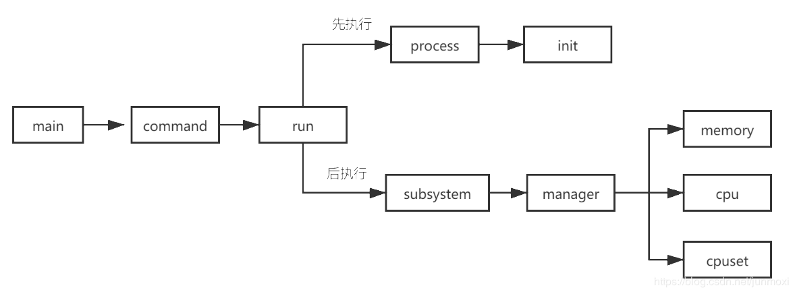

# docker-go
> 学习docker时，用go写的一个简易版docker,实现了docker基本功能以及资源限制隔离，镜像保存导出，日志文件输出等

## 参考
> 代码：https://github.com/pibigstar/go-docker.git \
> 文献： https://www.topgoer.cn/docs/seven-docker/seven-docker-1dpdobohuea3q

## 程序调用流程



**注意**
> windows下要修改goland的OS环境为 linux,不然只会引用`exec_windows.go`而不会引用`exec_linxu_go`
> 在Setting->Go->Build Tags & Vendoring -> OS=linux

## namespace
- uts : 隔离主机名
- pid : 隔离进程pid
- user : 隔离用户
- network : 隔离网络
- mount : 隔离挂载点
- ipc : 隔离System VIPC和POSIX message queues

## cgroup
> 主要是使用三个组件相互协作实现的，分别是：subsystem, hierarchy, cgroup,

- cgroup: 是对进程分组管理的一种机制
- subsystem: 是一组资源控制的模块
- hierarchy: 把一组cgroup串成一个树状结构(可让其实现继承)

### 实现方式
> 主要实现方式是在`/sys/fs/cgroup/` 文件夹下，根据限制的不同，创建一个新的文件夹即可，kernel会将这个文件夹
> 标记为它的`子cgroup`, 比如要限制内存使用，则在`/sys/fs/cgroup/memory/` 下创建`test-limit-memory`文件夹即可，将
> 内存限制数写到该文件夹里面的 `memory.limit_in_bytes`即可


## 环境配置
### 设置CentOS支持aufs
查看是否支持
```bash
cat /proc/filesystems
```
安装aufs
```bash
cd /etc/yum.repo.d
# 下载文件
wget https://yum.spaceduck.org/kernel-ml-aufs/kernel-ml-aufs.repo
# 安装
yum install kernel-ml-aufs
# 修改内核启动
vim /etc/default/grub
## 修改参数
GRUB_DEFAULT=0

# 重新生成grub.cfg
grub2-mkconfig -o /boot/grub2/grub.cfg

# 重启计算机
reboot
```

## 指令小记

- 查看Linux程序父进程
```bash
pstree -pl | grep main
```
- 查看进程id
```bash
echo $$
```
- 查看进程的uts
```bash
readling /proc/进程id/ns/uts
```
- 创建并挂载一个hierarchy
> 在这个文件夹下面创建新的文件夹，会被kernel标记为该`cgroup`的子`cgroup`
```bash
mkdir cgroup-test
mount -t cgroup -o none,name=cgroup-test cgroup-test ./cgroup-test
```
- 将其他进程移动到其他的`cgroup`中
> 只要将该进程的ID放到其`cgroup`的`tasks`里面即可
```bash
echo "进程ID" >> cgroup/tasks 
```

- 导出容器
```bash
docker export -o busybox.tar 45c98e055883(容器ID)
```
- 移除mount
```bash
unshare -m
```